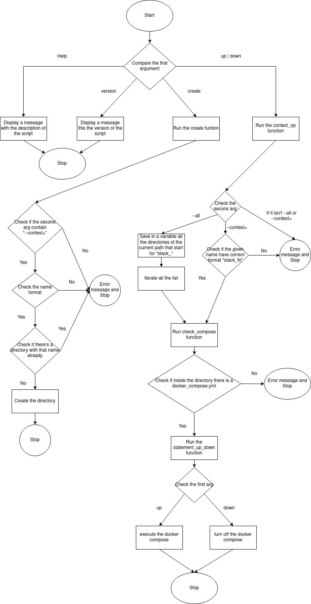

# CLI. Docli

## DESCRIPTION
This repository contain a bash script that administrate a workplay of Docker compose. And the diferent utilities of the script are:
    * Create a new empty directory.
    * Run one or all the docker-compose in the workplace.
    * Shut down one or all the docker-compose in the workplace.
    * Display the version.
    * Display the script's information.
Warning: when you run the script remmember that it take as directory you're in, or you can modify it to uso a specify absolute path(but it is you to modify it).

## Table of contents
- [Analysis](#analisys)
    * [Tecnologies](#tecnologies)
    * [Utilities](#utilities-it-should-have)
    * [Diagram](#diagram)
- [Desing](#desing)
    * [Main](#1-the-main-of-the-script)
    * [Help](#2-the-help-function-that-display-the-utilities-of-the-script)
    * [Version](#3-the-version-function-that-display-the-version)
    * [Create](#4-the-create-function-that-create-the-repository)
    * [Up-Down](#5-the-funtion-context_op)
- [Credits](#credits)


## Analysis
### Tecnologies
This script require:
 - Bash(saved in /bin/bash).
 - mkdir.
 - ls.
 - grep.
 - echo.
 - docker-compose.

### Utilities it should have
    1. The script work in a workplace with directories that have the the format stack_N and inside a docker compose, to it have a json named inventary which save the name of the directory and the services the docker compose has. But the json is not implemented now and will be done in future versions.
    2. The script have to display a help option that show the information about itslef with the command `--help`.
    3. The script have to have a version of itself and show it woth the command `--version`.
    4. The script have to create a directory only if you pass a context to in. In a future version save it in inventary.
    5. The script have to boot the docker compose in 1 or all the directories with the correct format, in this case stack_* <-- Numeric.
        * If it's only one pass `--context=name`.
        * If it's all pass `--all`.
    6. The script have to shut down the docker-compose in 1 or all the directories with the same option that the boot have.
    7. Is expected a utility that read and save the services every directory has in the inventary.
### Diagram


## Design
### 1. The main of the script.
This is the main of the script and hadle the first option given.
```shell
{
    case $1 in
        --prueba)
            prueba
            ;;
        --help)
            help
            ;;
        --version)
            version
            ;;
        create)
            create $2
            ;;
        up)
            context_op $1 $2
            ;;
        down) 
            context_op $1 $2
            ;;
        *)
            echo "ERROR TRY WITH: docli [OPTION] ... [DIRECTORY] ..."
            ;;
    esac
} 
```
### 2. The help function that display the utilities of the script.
This only display the descripption and way to use the script.
```shell
{
    help(){
        echo "
            NAME
                docli - manage docker-compose stacks centrally
            SYNOPSYS
                docli [OPTION] ... [DIRECTORY] ...
            DESCRIPTION
                Manage multiple docker-compose stacks with a single command.
                --all apply the command to all groups in the inventory
                --context[=CTX] inventory group to apply the command
                --help display this help message and exit
                --version output version information and exit
                The OPTIONS supported include:
                    Create: Creates a new empty directory. Must be followed by
                    the --context flag. The directory name will be the one
                    passed within the context. E.g.:
                    docli create --context=stack_1
                    
                    Up: Passes the \"docker-compose up -d\" command to the
                    specified context. Can be used with --context or --all.
                    docli up --context=stack_1
                    
                    Down: Passes the \"docker-compose down -d\" command to the
                    specified context. Can be used with --context or --all.
                    docli down --all
        "
    }
}
```
### 3. The version function that display the version
For this with create a variable in the script that save the version the script is using and is you improve it in the future you only have to change this variable and dont search for where it is used.
```shell
{
    version="1.0.0"
    version(){
	echo "version: $version"
    }
}
```

### 4. The create function that create the repository
This function check the context given and search if the directory already exist and check if the format given is correct. if there isn't a directory with the same name and the format is correct it create thank to mkdir the directory.
```shell
{
    #Check if have --context= and if all ok
    #Create a directory
    #@arg = $2
    create(){
        case $1 in 
            --context=*)
                if [[ "${1##*=}" == "stack_"* && "${1##*_}" =~ ^[0-9]+$ ]]
                then
                    if ! [ -d ${1##*=} ]
                    then 
                        mkdir "${1##*=}"
                    else
                        echo "There is a directory with this name already"
                    fi
                else
                    echo "Format not correct try: stack_N"
                fi
                ;;
            *)
                echo "--context=[] expected"
                ;;
        esac
    }
}
```

### 5. The funtion context_op
This function check if the second option given is all or a single directory.
    * If is all, it take all the directories in or path that have the format "stack_" and start to iterate loading the function check_compose.
    * If is a single directory it check if the format given is correct and late load the function check_compose
This function use the function in the 6.

```shell
{
    #Check if pass -all or a lone directory and call statement_up_down
    #In -all get all the directories
    #arg=$1
    #arg=$2
    context_op(){
        if [ "$2" == "--all" ];
        then
            list="$(ls -d */ | grep -F stack_)"
            for i in ${list[@]}
            do
                check_compose $1 $i
            done	
        elif [[ ${2:0:10} == "--context=" ]]
        then
            i="${2##*=}"
            if [[ "${i:0:6}" == "stack_" && "${i:6}" =~ ^[0-9]+$ ]]
            then
                check_compose $1 $i
            else
                echo "format error try: --context=stack_N"
            fi
        else
            echo "format error try: --context=[]"
        fi
    }
}
```
### 6. The function check_compose
This function check if inside the directory given there is a docker_compose if exist it load the function statement_up_down

```shell
{
    #Check if the directory have a dockercompose
    #@arg1=$i
    check_compose(){
        if [ -f $1/docker_compose.yml ]
        then 
            statement_up_down $1 $i
        else
            echo "The directory: $i doesn't have docker_compose"
        fi
        
    }
}
```

### 7. The funtion statement_up_down
This function check if arg 1 is up or down, go inside the directory in arg i, execute the up or down and go back to the directory we run the script.
```shell
{
    #Check if is up or down and run the correct command
    #arg=$1 <-- up or down
    #arg=i <-- the directory name
    statement_up_down(){
        if [ "$1" == "up" ]
        then
            cd $i
            {
                docker-compose up
            }||
            {
                echo "Fallo en docker compose"
            }
            cd ..
        else
            cd $i
            {
                docker-compose down
            }||
            {
                echo "Fallo en docker compose"
            }
            cd ..
        fi
    }
}
```

## Credits
Made by me Malkien ^^
